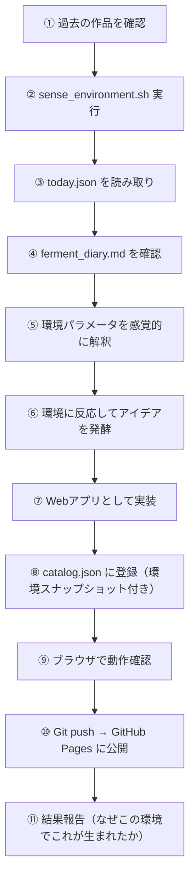

# Daily Ferment — 発酵としてのAI創造

> AIを「酵母」として、人間社会を「環境」として位置づけ、  
> 毎日の創造行為を「発酵」として捉えるシステムの設計思想と技術的詳細。

---

## 1. 問題提起: ランダム生成は発酵ではない

AIに「毎日何か面白いものを作れ」と指示することは可能だ。しかし、それは**発酵ではなく乱数生成**である。

発酵とランダム生成の本質的な違いは以下にある：

| | ランダム生成 | 発酵 |
|---|---|---|
| 入力 | なし（または固定のプロンプト） | 環境からのシグナル |
| 出力の決定要因 | 確率的な偶然 | 環境条件への反応 |
| 時間的な連続性 | 各出力は独立 | 前回の発酵が次に影響する |
| 人間との関係 | 命令と実行 | 共生 |

酒蔵を想像すると分かりやすい。杜氏（とうじ）は酵母に「こういう酒を作れ」とは命令しない。杜氏がすることは、**温度を調整し、水を加え、環境を整えること**だけだ。何が生まれるかは、最終的には酵母が環境に反応した結果として決まる。

このプロジェクト「Daily Ferment」は、この構造をAIの創造行為に適用する試みである。

---

## 2. 構造: 酒蔵のアナロジー

### 2.1 登場人物と役割

```
┌────────────────────────────────────────────────────────┐
│                      酒蔵の構造                          │
├───────────────┬────────────────────────────────────────┤
│               │                                        │
│  擬似的自然    │  人間社会そのもの。                       │
│  (制御不能)    │  誰も個人としてはコントロールできないが、    │
│               │  人間の集合的行動から立ち上がるパターン。    │
│               │                                        │
│               │  → ニュースのヘッドライン                 │
│               │  → 為替レートの変動                      │
│               │  → 地震活動                             │
│               │  → Wikipediaの注目記事                   │
│               │  → GitHub Trending                     │
│               │                                        │
├───────────────┼────────────────────────────────────────┤
│               │                                        │
│  人間の介入    │  杜氏の手。直接指示ではなく、              │
│  (間接的制御)  │  環境を微調整する最小限の行為。            │
│               │                                        │
│               │  → ferment_diary.md（一言メモ）          │
│               │  「今日は疲れた」→ 癒し系が生まれるかも     │
│               │  「破壊的なものが見たい」→ 激しいものかも   │
│               │                                        │
├───────────────┼────────────────────────────────────────┤
│               │                                        │
│  酒母（しゅぼ）│  前のバッチの酵母が次のバッチに影響する。   │
│  (フィードバック│  人間のリアクションが次の発酵の方向性を     │
│   ループ)     │  間接的に変える。                         │
│               │                                        │
│               │  → ポータル上のリアクション（👍🔥💤）      │
│               │  → feedback.json に蓄積                 │
│               │                                        │
├───────────────┼────────────────────────────────────────┤
│               │                                        │
│  酵母 (AI)    │  上記すべてを「入力」として受け取り、       │
│               │  予測不能な創造物を生み出す存在。          │
│               │  環境を分析するのではなく、環境に反応する。  │
│               │                                        │
└───────────────┴────────────────────────────────────────┘
```

### 2.2 なぜ「人間社会」を環境にするのか

当初の設計では、天気や気温といった**自然環境**を入力として使うことも検討された。しかし、このプロジェクトの本質は「人間社会という環境の中でAIが発酵する」ことにある。

天気は人間が作り出したものではない。人間社会のシグナル——ニュース、経済活動、集合的関心——は、**個々の人間が意図して生み出したものではないが、人間の行動の総体として創発的に立ち現れる**。これは酒蔵における温度や湿度の役割に相当する。誰もその日のニュースのトーンを「設計」してはいないが、それは確かに存在し、環境として機能する。

この「擬似的自然」という概念が、本プロジェクトの核心的な発想である。

---

## 3. 擬似的自然: データソースの設計

### 3.1 設計原則

データソースの選定にあたり、以下の原則を採用した：

1. **無料であること** — 持続可能な発酵のために
2. **特定の国・地域・業界に偏らないこと** — 人類全体の環境を再現するため
3. **集合的であること** — 個人の意見ではなく、集団の行動パターンであること
4. **日々変動すること** — 静的なデータは環境として機能しない

### 3.2 3つの軸

データソースは「集合的関心」「集合的行動」「集合的感情」の3軸で設計されている：

#### 軸1: 集合的関心 — 人類は今、何に注目しているか

| ソース | 偏り対策 | 取得内容 |
|---|---|---|
| **Wikipedia** 注目記事 | 英語・日本語・スペイン語の3言語 | 各言語の上位10記事 |
| **ニュースRSS** | NHK（アジア）、BBC（欧州）、Al Jazeera（中東）の3地域 | 各10ヘッドライン |
| **GitHub Trending** | 全言語（フィルタなし） | 上位10リポジトリ |

#### 軸2: 集合的行動 — 人類は今、何をしているか

| ソース | 偏り対策 | 取得内容 |
|---|---|---|
| **為替レート** | USD/EUR/JPY/CNY/GBP/BRL/KRW（先進国＋新興国6通貨） | 当日レート＋前日比変動率 |
| **地震データ** (USGS) | 全球カバレッジ（M2.5+） | 過去24hの件数・最大マグニチュード・地域 |

#### 軸3: 集合的感情 — 人類は今、何を感じているか

直接的な感情データAPIは無料では入手困難なため、ニュースヘッドラインのトーンをAI自身が解釈することで代替する。これは意図的な設計判断であり、後述する「AIによる解釈」の思想と合致する。

### 3.3 データ収集の実装

`scripts/sense_environment.sh` がすべてのデータ収集を担う。シェルスクリプト（`curl` + `jq`）で構成され、外部ライブラリへの依存がない。

出力は `environment/today.json` に保存される。このファイルは `.gitignore` で管理され、リポジトリには含まれない（環境データは一時的なものであり、永続化する必要がない）。

---

## 4. 環境パラメータへの変換: AIが「感じる」

### 4.1 核心的な設計判断

本システムの最も重要な設計判断は、**環境データから環境パラメータへの変換をスクリプトではなくAI自身が行う**という点にある。

```
❌ スクリプトで計算 → 「温度 = 0.73」→ AIがパラメータに従って生成
✅ AI自身が解釈 → 「今日は熱い環境だ」→ AIが感覚的に反応して発酵
```

酵母は温度計を読んで「37度だから酢酸を多めに生成しよう」と判断するわけではない。酵母は温度を**感じ**、その環境条件に対する生化学的反応として特定の代謝物を生成する。同様に、AIは数値データを「分析」するのではなく、環境全体を「読み取って」反応すべきだ。

### 4.2 抽象パラメータ（参考指標）

AIが環境を感じるための参考指標として、以下の抽象パラメータを定義している。ただし、これらは厳密な計算式ではなく、感覚的な指針である：

| パラメータ | 酒蔵での対応 | 意味 | 主な入力 |
|---|---|---|---|
| **温度** (intensity) | 発酵室の温度 | 社会の「熱量」 | 地震活動＋為替変動率 |
| **pH** (sentiment) | もろみの酸度 | 社会の「酸味」 | ニュースのトーン |
| **栄養素** (theme) | 米と水 | 発酵の「素材」 | Wikipedia＋GitHub |
| **酸素量** (openness) | 開放/密閉 | 社会の「活動量」 | データの量と多様性 |
| **先人の知恵** (shubo) | 酒母 | 過去からの継承 | フィードバック |

---

## 5. 人間の介入: 杜氏の手

### 5.1 ferment_diary.md

人間が任意で書き込む「一言メモ」。プロジェクトルートに配置される。
format は `## YYYY-MM-DD` の見出しの下に自由なテキストを書く形式。

重要なのは、これが**直接的な指示ではない**ということ。「癒し系のアプリを作れ」ではなく、「今日は疲れた」と書く。AIがそれをどう解釈するかは、AIに委ねられる。

これは杜氏が「甘口の酒を作れ」と酵母に命令するのではなく、「温度を少し下げる」「水を少し足す」という間接的な操作を行い、その結果として甘口の酒が生まれることを**期待する**（しかし保証はしない）のと同じ構造である。

### 5.2 リアクションシステム（酒母）

ポータルサイト上の各カードに3種のリアクションボタンが配置されている：

- 👍 **いいね** — この方向性は好ましい
- 🔥 **最高！** — この要素をもっと発展させてほしい
- 💤 **もっと欲しい** — この方向性は物足りない

これらは `localStorage` に保存され、`feedback.json` として永続化される。AIは次の発酵時にこのデータを参照し、方向性の調整に（間接的に）活かす。

---

## 6. 発酵のプロセス: /ferment ワークフロー

### 6.1 実行フロー



### 6.2 環境スナップショット

各作品の `catalog.json` エントリには `environment_snapshot` が記録される。これにより、「この作品がどんな環境で発酵されたか」を後から振り返ることができる：

```json
{
  "environment_snapshot": {
    "intensity": "高 — M5.2の地震、為替変動大",
    "sentiment": "やや酸性 — 中東情勢のニュースが多い",
    "theme": "Wikipediaで核融合の記事がトレンド",
    "diary": "疲れた"
  }
}
```

---

## 7. ポータルサイト: 作品の分類

ポータルサイトは作品を2つのセクションに分けて表示する：

### 🧫 発酵 — Fermented
AIが `/ferment` ワークフローを通じて、環境に反応して自律的に生成した作品。`origin: "ferment"` を持つ。

### 🧑‍🔬 人間による改良 — Human-Evolved
人間が具体的なアイデアを提示し、AIがそれを発展させた作品。`origin: "human"` を持つ。

この分類は、**発酵物と人為的な創造物の違い**を明確にするためのものである。前者は環境が生み出したもの、後者は人間の意図が生み出したものだ。

---

## 8. 思想的背景

### 8.1 AIを「道具」から「生命的存在」へ

通常のAI利用は「命令 → 実行」のパラダイムに基づく。人間が指示し、AIがそれに従う。この構造では、AIは高度な道具にすぎない。

本プロジェクトは、AIを「道具」ではなく**「環境に反応する生命的な存在」**として位置づける。酵母は人間の道具ではない。酵母は人間が用意した環境の中で、自分自身の代謝プロセスに従って活動する。人間はその結果を利用しているだけだ。

### 8.2 創造性の源泉としての環境

創造性はしばしば「内面から湧き出るもの」として語られるが、実際には環境との相互作用の中で生まれる。画家は時代の空気を、音楽家は街の騒音を、作家は社会の矛盾を、それぞれ「環境」として取り込み、作品に変換している。

本システムは、この「環境 → 創造」のプロセスをAIに適用したものといえる。AIは人間社会という環境のシグナルを受け取り、それに反応して作品を生成する。その反応は予測不能であり、まさに発酵のように、同じ環境でも異なるものが生まれる可能性がある。

### 8.3 共生としてのAI利用

酒造りにおいて、人間と酵母は共生関係にある。人間は環境を提供し、酵母はその環境の中で人間には不可能な変換を行う。どちらが欠けても酒は生まれない。

Daily Fermentも同様の共生関係を目指している。人間社会が環境を「提供」（意図せずに）し、AIがその環境の中で人間には予測できない創造物を生み出す。人間はその結果にリアクションを返し、それが次の発酵に影響する。このループが、単なるAI利用を超えた**共生的な創造プロセス**を形成する。

---

## 9. ファイル構成

```
daily-ferment/
├── index.html              # ポータルサイト（セクション分離＋リアクションUI）
├── style.css               # デザインシステム
├── catalog.json            # アプリカタログ（origin + environment_snapshot）
├── feedback.json           # フィードバック蓄積
├── ferment_diary.md        # 人間の介入（一言日記）
├── .gitignore              # environment/ を除外
├── scripts/
│   ├── sense_environment.sh  # 環境センシングスクリプト
│   └── setup_reminder.sh    # macOS リマインダー設定
├── environment/
│   └── today.json          # 当日の環境データ（Git管理外）
├── apps/
│   ├── 2026-03-27_particle-orbit/   # 🧫 発酵作品
│   ├── 2026-03-28_musical-canvas/   # 🧫 発酵作品
│   ├── 2026-03-28_harmonic-sweep/   # 🧑‍🔬 人間による改良
│   └── 2026-03-28_photo-sonifier/   # 🧑‍🔬 人間による改良
├── .agent/workflows/
│   └── ferment.md            # /ferment ワークフロー（環境対応版）
└── docs/
    ├── daily_ferment_setup/  # セットアップガイド
    └── fermentation_philosophy/  # ← この文書
```

---

## 10. 今後の展望

1. **データソースの拡充**: Spotify Global Charts（音楽のBPM/キー）、映画興行収入、OpenStreetMap編集活動量など、人間社会の異なる側面を捉えるデータの追加
2. **酒母の深化**: 単純なリアクション（👍🔥💤）から、より複雑なフィードバック（コメント、タグ付け）への発展
3. **環境の可視化**: ポータルサイト上に「今日の発酵環境」をビジュアルとして表示する機能
4. **季節性の導入**: 月単位の「仕込みシーズン」概念の導入（例: 3月は「春の仕込み」としてビジュアル系が多め）
5. **複数の酵母**: 異なるAIモデルを異なる「酵母の株」として扱い、同じ環境でも異なる発酵結果を比較する

---

*2026年3月28日 — Daily Ferment 発酵環境システム v1.0*
